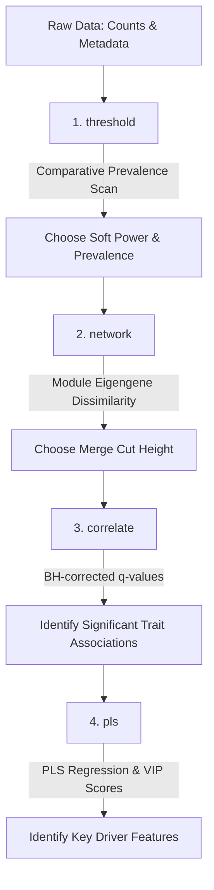

# WGCNA PLS-VIP Tool

A standardized, command-line pipeline that integrates **Weighted Gene Co-expression Network Analysis (WGCNA)** and **Partial Least Squares Variable Importance in Projection (PLS-VIP)** regression. 

This tool is designed to work with high-throughput tables (like microbiome OTU/ASV tables or RNA-seq gene expression matrices) and metadata phenotypic files, running data preprocessing, scale-free topology parameter fitting, network construction, and phenotypic driver identification.

---

## Workflow Overview

The tool is organized into four sequential steps, wrapped in a single Python executable:



---

## Installation & Setup

### 1. Conda Environment
The tool runs within the `bog-incubations` conda environment:
```bash
conda activate bog-incubations
```

### 2. R Package Dependencies
Ensure the following R packages are installed in your environment:
* `WGCNA`
* `vegan`
* `pls`
* `optparse`
* `RColorBrewer`

---

## Configuration

All steps are controlled by a single YAML configuration file. A template is provided in `wgcna_config_example.yaml`:

```yaml
# 1. Input File Paths
counts_file: "data/counts.csv"
metadata_file: "data/metadata.csv"
taxonomy_file: "data/taxonomy.csv"
sample_id_col: "sample_id"

# 2. Output Directory
output_dir: "output"

# 3. Preprocessing Parameters
min_prevalence_pct: 10
transform: "hellinger"  # Choose: 'hellinger', 'relative', or 'none'

# 4. Network Construction Parameters (WGCNA)
power: 12
TOMType: "signed"
networkType: "signed"
mergeCutHeight: 0.15
maxBlockSize: 1800

# 5. Metadata Traits to Correlate with Modules
traits:
  - "alphaC"
  - "T_soil.deg_C"
  - "DepthAvg__"

# 6. PLS-VIP Target Analyses (Optional)
# If this block is commented out or empty, the pipeline will automatically detect
# and run PLS-VIP on all pairs with a significant correlation (q-value < 0.05).
# pls_analyses:
#   - module: "blue"
#     parameter: "alphaC"
```

---

## Usage Instructions

The tool is directly executable: `./wgcna-vip [subcommand] --config [config.yaml]`

### Step 1: soft-Thresholding Analysis
Tests how different prevalence filtering cutoffs (`5%`, `10%`, `15%`, `20%`, `25%`, and `30%`) affect your scale-free topology fit ($R^2$) and mean connectivity.
```bash
./wgcna-vip threshold --config wgcna_config_example.yaml
```
* **Output**: `output/preprocess/thresholding_diagnostics.pdf`
  * **Page 1**: Sample outlier clustering dendrogram at your target prevalence.
  * **Subsequent Pages**: Comparative fit index and mean connectivity plots for each scanned prevalence.
* **Goal**: Choose a `min_prevalence_pct` and a soft-thresholding `power` where the scale-free fit ($R^2$) plateaus above `0.80`.

---

### Step 2: Network Construction & Module Detection
Constructs co-abundance networks, groups features into color-coded modules, and calculates module eigengenes (MEs).
```bash
./wgcna-vip network --config wgcna_config_example.yaml
```
* **Outputs**:
  * `output/network/module_membership.csv`: Assignments (color & label) for every feature.
  * `output/network/module_eigengenes.csv`: Profile summaries (eigengenes) for each module across samples.
  * `output/network/unmerged_module_eigengene_clustering.pdf`: Dendrogram of modules **before** merging.
  * `output/network/module_eigengene_clustering.pdf`: Dendrogram of modules **after** merging.
* **Goal**: Inspect the unmerged dendrogram to see if modules connect below a certain distance. Adjust your `mergeCutHeight` (e.g., `0.15` or `0.20`) to combine redundant modules.

---

### Step 3: Module-Trait Correlation
Correlates module eigengenes with metadata parameters and applies Benjamini-Hochberg FDR correction.
```bash
./wgcna-vip correlate --config wgcna_config_example.yaml
```
* **Outputs**:
  * `output/correlation/longform_module_trait_table.csv`: Table of correlations, raw p-values, and adjusted q-values.
  * `output/correlation/module_trait_relationships.pdf`: Heatmap of module-trait relationships labeled with correlation coefficients, raw p-values, and adjusted q-values.
* **Goal**: Identify which modules have a statistically significant relationship (q-value $< 0.05$) with your phenotypes.

---

### Step 4: PLS-VIP Predictive Modeling
Fits a PLS regression model predicting a metadata trait using only the features inside a correlated module, calculating Variable Importance in Projection (VIP) scores to extract key driving features.
```bash
./wgcna-vip pls --config wgcna_config_example.yaml
```
* **Auto-Mode (Recommended)**: If the `pls_analyses` list is commented out in your config, the tool automatically scans the correlation table, detects all module-trait pairs with adjusted `q-value < 0.05` and absolute Pearson correlation `|Correlation| >= pls_min_cor` (defaults to `0.30`), and executes them sequentially.
* **Manual Mode**: Uncomment and specify target pairs in `pls_analyses` to override auto-mode.
* **R-squared Filter**: In both modes, the model is checked against the `pls_min_r2` threshold (defaults to `0.30`). If the maximum $R^2$ across all components does not exceed this value, the pair is skipped, matching your project's historical predictive criteria.
* **Outputs** (generated for each pair, e.g., `blue` module predicting `alphaC`):
  * `output/pls_vip/pls_blue_alphaC_vip_rankings.csv`: Ranked list of all features in the module sorted by VIP scores, annotated with taxonomic Genus if `taxonomy.csv` is provided.
  * `output/pls_vip/pls_blue_alphaC_plots.pdf`:
    * **Left**: Measured vs. Predicted cross-validation fit plot ($R^2$ and RMSE).
    * **Right**: Barplot of the Top 15 driving features labeled with Genus, with a dashed line showing significance (`VIP > 1.0`).

---

## Troubleshooting

### locked PDF Files
If an analysis script fails with `null device 1` or R warnings during plotting, the output PDF may be opened and locked by another viewer or program on the cluster. The tool automatically attempts to clear graphics devices and unlink old files, but you may need to close your PDF viewer to free the lock.
