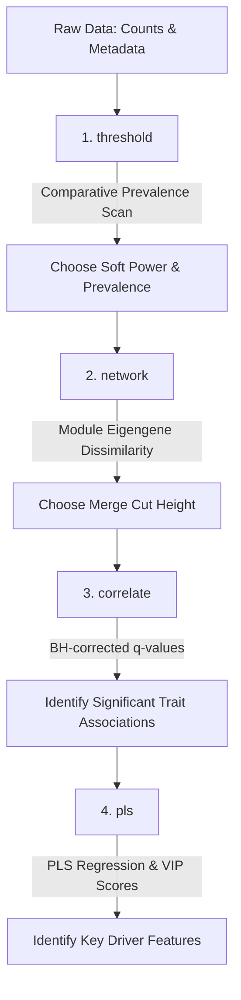

# ANEMONE

A standardized, command-line pipeline that integrates **Weighted Gene Co-expression Network Analysis (WGCNA)** and **Partial Least Squares Variable Importance in Projection (PLS-VIP)** regression. 

**ANEMONE** is designed to work with high-throughput biological tables (such as microbiome OTU/ASV feature tables or RNA-seq gene expression matrices) alongside phenotypic metadata files. It orchestrates data preprocessing, scale-free topology parameter fitting, network construction, module-trait correlation analysis, and predictive driver feature identification.

---

## Workflow Overview

The tool is organized into four sequential analytical steps, executed via the `anemone` command-line orchestrator:



---

## Installation & Setup

### Prerequisites
* **Linux / macOS** operating system
* **Python**: `>= 3.8` (with `PyYAML` package)
* **R**: `>= 4.0` (with Rscript available in PATH)
* **Conda / Mamba** (recommended for managing environment dependencies)

---

### Step 1: Create Conda Environment via `environment.yml` (Recommended)

You can create a self-contained Conda environment containing Python, R, and all required dependencies in a single step using `environment.yml`:

```bash
# Create the conda environment
conda env create -f environment.yml

# Activate the environment
conda activate anemone
```

Alternatively, if using Mamba:
```bash
mamba env create -f environment.yml
conda activate anemone
```

---

### Step 2: Alternative R Package Installation (R Console)

If you prefer using your system R environment, install the required packages directly from CRAN and Bioconductor:

```R
# Install BiocManager if not present
if (!requireNamespace("BiocManager", quietly = TRUE))
    install.packages("BiocManager")

# Install WGCNA from Bioconductor
BiocManager::install("WGCNA")

# Install CRAN dependencies
install.packages(c("vegan", "pls", "optparse", "RColorBrewer", "yaml"))
```

---

### Step 3: Clone Repository & Setup Executable

Clone the repository and ensure the `anemone` CLI script has execution permissions:

```bash
# Clone repository
git clone https://github.com/your-username/anemone.git
cd anemone

# Grant execute permission to CLI script
chmod +x anemone
```

#### Add `anemone` to System PATH (Optional)

To execute `anemone` from any directory without specifying `./`, link it to `~/bin` or `/usr/local/bin`:

```bash
# Create local bin directory if it doesn't exist
mkdir -p ~/bin

# Create symbolic link
ln -s $(pwd)/anemone ~/bin/anemone

# Add ~/bin to PATH in bashrc/zshrc if not already present
echo 'export PATH="$HOME/bin:$PATH"' >> ~/.bashrc
source ~/.bashrc
```

---

### Step 4: Verify Installation

Verify that the CLI parser runs cleanly:

```bash
# Check ANEMONE CLI help
./anemone --help
```

Expected output:
```text
usage: anemone [-h] --config CONFIG {threshold,network,correlate,pls,run} ...

anemone: CLI tool for WGCNA and PLS-VIP analysis

positional arguments:
  {threshold,network,correlate,pls,run}
    threshold           Perform prevalence filtering and plot soft-threshold powers
    network             Construct the co-expression network and identify modules
    correlate           Correlate module eigengenes with metadata traits
    pls                 Run PLS regression and compute VIP scores for specified module/parameter pairs
    run                 Run all steps in the pipeline sequentially end-to-end

options:
  -h, --help            show this help message and exit
```

---

## Configuration

All pipeline steps are configured using a single YAML configuration file. A standard template is provided in `anemone_config_example.yaml`:

```yaml
# 1. Input File Paths (Relative to execution directory or absolute paths)
counts_file: "data/counts.csv"       # Taxa/genes as rows, samples as columns
metadata_file: "data/metadata.csv"   # Samples as rows, metadata columns as traits
taxonomy_file: "data/taxonomy.csv"   # (Optional) Taxa as rows, taxonomic levels as columns
sample_id_col: "sample_id"           # Column in metadata matching counts column names

# 2. Output Directory
output_dir: "output"

# 3. Preprocessing Parameters
min_prevalence_pct: 10               # Keep taxa present in >= min_prevalence_pct % of samples
# min_num_samples: 9                 # (Optional) Keep features present in > min_num_samples samples (strict inequality)
                                     # Bypasses min_prevalence_pct and replicates original Rmd filtering.
transform: "hellinger"               # Preprocessing transformation: 'hellinger', 'relative', or 'none'

# 4. Network Construction Parameters (WGCNA)
power: 12                            # Soft-threshold power (choose after running 'threshold' step)
TOMType: "signed"                    # Topological Overlap Matrix type
networkType: "signed"                # Network type
mergeCutHeight: 0.1                 # Cut height for merging similar modules
maxBlockSize: 1800                   # Maximum block size for blockwise modules

# 5. Metadata Traits to Correlate with Modules (Numeric traits)
traits:
  - "alphaC"
  - "T_soil.deg_C"
  - "DepthAvg__"
  - "Habitat__"

# 6. PLS-VIP Target Analyses (Specific Module/Trait pairs)
# If this block is commented out or empty, the pipeline will automatically detect and
# run PLS-VIP on all module-parameter pairs that have a significant correlation (BH-adjusted q-value < 0.05).
# Alternatively, you can uncomment and define specific pairs to analyze manually:
# pls_analyses:
#   - module: "blue"
#     parameter: "alphaC"
#   - module: "blue"
#     parameter: "T_soil.deg_C"

# 7. PLS-VIP R-squared Filter
pls_min_r2: 0.30                     # Minimum R^2 threshold to proceed to VIP calculation (set to 0.0 to disable)
pls_min_cor: 0.60                    # Minimum absolute correlation |r| to proceed to PLS-VIP in auto-mode (set to 0.0 to disable)
```

---

## Usage Instructions

Command syntax: `./anemone [subcommand] --config [config.yaml]`

### Run the Entire Pipeline End-to-End
Execute all four pipeline steps sequentially (threshold, network, correlate, and pls-vip):
```bash
./anemone run --config anemone_config_example.yaml
```

---

### Run Steps Individually

#### Step 1: Soft-Thresholding Diagnostics (`threshold`)
Evaluates scale-free topology fit ($R^2$) and mean connectivity across prevalence filtering cutoffs (`5%`, `10%`, `15%`, `20%`, `25%`, and `30%`).
```bash
./anemone threshold --config anemone_config_example.yaml
```
* **Output**: `output/preprocess/thresholding_diagnostics.pdf`
  * **Page 1**: Sample outlier clustering dendrogram at your target prevalence.
  * **Subsequent Pages**: Comparative fit index and mean connectivity plots for each scanned prevalence.
* **Goal**: Select a `min_prevalence_pct` (or absolute `min_num_samples`) and soft-thresholding `power` where scale-free fit ($R^2$) plateaus above `0.80`.

#### Step 2: Network Construction & Module Detection (`network`)
Builds co-abundance networks, assigns features to color-coded modules, and calculates module eigengenes (MEs).
```bash
./anemone network --config anemone_config_example.yaml
```
* **Outputs**:
  * `output/network/module_membership.csv`: Module color & label assignments for each feature.
  * `output/network/gene_module_membership.csv`: Quantitative module membership correlations ($MM$) and p-values ($p.MM$) across all modules.
  * `output/network/module_eigengenes.csv`: Module profile summaries (eigengenes) per sample.
  * `output/network/unmerged_module_eigengene_clustering.pdf`: Module dendrogram **before** merging.
  * `output/network/module_eigengene_clustering.pdf`: Module dendrogram **after** merging.
* **Goal**: Review dendrograms and adjust `mergeCutHeight` (e.g., `0.15` or `0.20`) to merge closely related modules.

#### Step 3: Module-Trait Correlation (`correlate`)
Correlates module eigengenes with phenotypic parameters and applies Benjamini-Hochberg FDR correction.
```bash
./anemone correlate --config anemone_config_example.yaml
```
* **Outputs**:
  * `output/correlation/longform_module_trait_table.csv`: Table of Pearson correlations, raw p-values, and adjusted q-values.
  * `output/correlation/module_trait_relationships.pdf`: Heatmap of module-trait correlations labeled with correlation coefficients and q-values.
* **Goal**: Identify statistically significant module-phenotype associations ($q < 0.05$).

#### Step 4: PLS-VIP Predictive Modeling (`pls`)
Fits Partial Least Squares (PLS) regression models for correlated module-trait pairs and calculates Variable Importance in Projection (VIP) scores for driver discovery.
```bash
./anemone pls --config anemone_config_example.yaml
```
* **Auto-Mode (Recommended)**: Scans the correlation table automatically, detecting all module-trait pairs with adjusted `q-value < 0.05` and `|Correlation| >= pls_min_cor`.
* **Manual Mode**: Specify target pairs explicitly in `pls_analyses`.
* **Outputs** (generated for each target pair, e.g., `blue` module predicting `alphaC`):
  * `output/pls_vip/pls_blue_alphaC_vip_rankings.csv`: Ranked list of module features sorted by VIP score, with $MM$, $GS$, p-values, and taxonomic classifications.
  * `output/pls_vip/pls_blue_alphaC_plots.pdf`: 3-page diagnostic report ($MM$ vs $GS$ scatterplot, eigengene network dendrogram/heatmap, and PLS LOO fit / VIP score barplot).

---

## Troubleshooting

### Locked PDF Files
If R script execution produces `null device 1` warnings or plotting errors, an output PDF file may be locked by an external PDF viewer or cluster session. Ensure open PDF viewers are closed before re-running the command.
